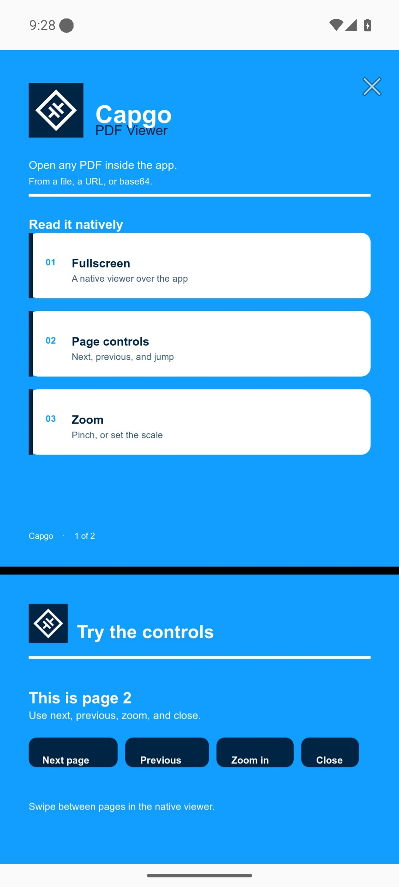
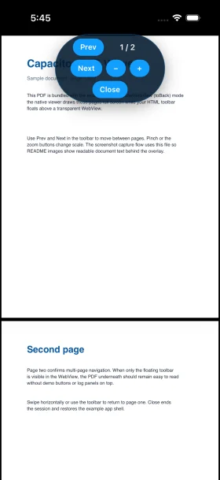
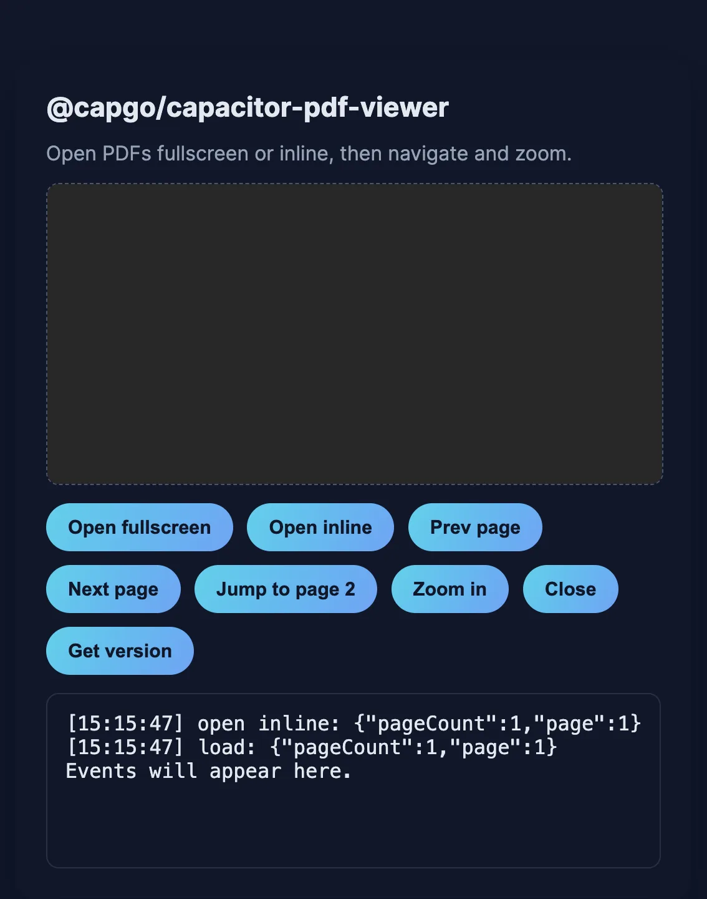

# @capgo/capacitor-pdf-viewer

<a href="https://capgo.app/"></a>

<div align="center">
  <h2><a href="https://capgo.app/?ref=plugin_pdf_viewer"> ➡️ Get Instant updates for your App with Capgo</a></h2>
  <h2><a href="https://capgo.app/consulting/?ref=plugin_pdf_viewer"> Missing a feature? We’ll build the plugin for you 💪</a></h2>
</div>

**@capgo/capacitor-pdf-viewer** embeds native PDF viewing in Capacitor apps on iOS, Android, and web. Instead of fighting WebView limitations or shipping a heavy JavaScript PDF renderer, you open files from a path, HTTPS URL (with custom headers), or base64 and get system-grade rendering: page navigation, pinch zoom, continuous or single-page scrolling, password-protected documents, fullscreen or inline layout, and events for load, errors, page changes, link taps, and close. On iOS it uses PDFKit; on Android it uses Pdfium; on web it uses the browser PDF viewer with blob URLs.

## Features

- Open PDFs from a device path, `file://` URL, HTTPS URL, or base64 (including `data:` URIs)
- Optional `headers` when downloading remote URLs (auth tokens, cookies)
- Password support for encrypted PDFs on iOS and Android
- Fullscreen overlay or **inline** mode anchored to a DOM element (`elementId`)
- **underWebView** / **`toBack`**: native PDF behind a transparent WebView with your HTML controls on top
- Continuous vertical scrolling or single-page mode
- Programmatic **goToPage**, **nextPage**, **previousPage**, **setZoom**, **hide**, **show**, **updateLayout**, and **close**
- Events: `load`, `pageChange`, `zoomChange`, `error`, `close`, `linkTap`

## Use cases

- Invoices, manuals, and tickets stored on device or returned from your API as base64
- Authenticated document download from a signed URL with custom HTTP headers
- Embedded PDF preview in a form or dashboard region (inline mode)
- Guided reading flows that jump to a page and listen for link taps inside the PDF

## Documentation

- [Plugin docs](https://capgo.app/docs/plugins/pdf-viewer/) on capgo.app
- [Tutorial](https://capgo.app/plugins/capacitor-pdf-viewer/) with install steps and examples
- [Capgo](https://capgo.app/) for live updates, native builds, and plugin support

<p align="center">
  
  
</p>

<p align="center">
  
  
</p>

## Compatibility

| Plugin version | Capacitor compatibility | Maintained |
| -------------- | ----------------------- | ---------- |
| v8.\*.\*       | v8.\*.\*                | ✅          |
| v7.\*.\*       | v7.\*.\*                | On demand   |
| v6.\*.\*       | v6.\*.\*                | On demand   |

Policy:

- New plugins start at version `8.0.0` (Capacitor 8 baseline).
- Backward compatibility for older Capacitor majors is supported on demand.

## Install

```bash
npm i @capgo/capacitor-pdf-viewer
npx cap sync
```

With Bun:

```bash
bun add @capgo/capacitor-pdf-viewer
bunx cap sync
```

## iOS setup

No extra Info.plist keys or entitlements are required by this plugin. It uses Apple PDFKit. Remote PDFs use `URLSession` with the headers you pass in `open`. For HTTPS URLs, follow your app's usual App Transport Security rules.

## Android setup

The plugin library targets **minSdk 24** (Android 7.0) and bundles Pdfium (`io.legere:pdfiumandroid`). The plugin `AndroidManifest.xml` is empty: it does not declare `INTERNET`, storage, or FileProvider entries. If you open **https** sources, add `INTERNET` to your **app** manifest:

```xml
<uses-permission android:name="android.permission.INTERNET" />
```

Local files and base64 do not need extra permissions beyond what your app already uses to read those paths.

## Web

No Capacitor sync steps are required for web. URL sources are fetched with your `headers`; `setZoom` is a no-op because zoom is controlled by the browser viewer. Passwords cannot be injected on web; the browser may prompt on its own.

## Usage

```typescript
import { PdfViewer } from '@capgo/capacitor-pdf-viewer';

await PdfViewer.addListener('pageChange', ({ page, pageCount }) => {
  console.log(`Page ${page} of ${pageCount}`);
});

const { pageCount, page } = await PdfViewer.open({
  source: 'https://example.com/manual.pdf',
  headers: { Authorization: 'Bearer YOUR_TOKEN' },
  mode: 'fullscreen',
  scrollMode: 'continuous',
  page: 1,
});

await PdfViewer.goToPage({ page: 2 });
await PdfViewer.setZoom({ scale: 1.25 });
await PdfViewer.close();
```

**Inline preview** in a div:

```typescript
await PdfViewer.open({
  source: base64FromYourApi,
  sourceType: 'base64',
  mode: 'inline',
  elementId: 'pdf-host',
});
```

**Password-protected file** (iOS and Android):

```typescript
await PdfViewer.open({
  source: '/path/on/device/encrypted.pdf',
  sourceType: 'path',
  password: 'secret',
});
```

On native shells, loading a PDF from the WebView origin URL often fails because that origin is not a real file server. Fetch the bytes in JavaScript and pass `sourceType: 'base64'` instead (see `example-app/`).

## Build your own PDF viewer UI

Use **`mode: 'underWebView'`** (or **`toBack: true`**) when you want PDFKit / Pdfium rendering with **zero native chrome**. The PDF sits **behind** your Capacitor WebView. You draw buttons, page indicators, and toolbars in HTML while the native layer handles scroll, pinch zoom, and link hit testing through transparent areas.

**Why:** Full control over branding and UX (Ionic, Tailwind, or plain HTML) without reimplementing PDF rendering in JavaScript.

**Setup:** Make the WebView stack transparent so the PDF shows through (same idea as [`@capgo/camera-preview`](https://github.com/Cap-go/capacitor-camera-preview)):

```css
html,
body {
  background: transparent !important;
}

/* Let touches reach the PDF except on your controls */
body.pdf-reading {
  pointer-events: none;
}

.custom-toolbar,
.custom-toolbar button,
.custom-pdf-ui button,
[data-capgo-pdf-interactive],
[data-capgo-pdf-interactive] button {
  pointer-events: auto;
}
```

On Android and iOS the plugin places the PDF below the WebView, makes the WebView stack transparent, and routes touches outside interactive HTML controls to the native PDF view. The native touch router treats these DOM nodes as interactive (their `getBoundingClientRect()` regions receive WebView touches; everything else can go to the PDF when `pointer-events` allows it):

- `button`, `a`, `input`, `textarea`, `select`, `label`
- any element with **`data-capgo-pdf-interactive`** (use this on a toolbar container so the whole bar stays tappable)
- elements matching **`.custom-toolbar`** or **`.custom-pdf-ui button`**

Elements with `pointer-events: none`, `visibility: hidden`, or `display: none`, or inside a `[hidden]` ancestor, are ignored. Use `pointer-events: none` on non-interactive page regions and `pointer-events: auto` on controls (see CSS above). On Android the plugin also calls `requestTransparentRegion` for correct compositing. On iOS a native hit-test wrapper applies the same rules while the WebView keeps HTML controls.

**Example (custom toolbar):**

```html
<div class="custom-toolbar pdf-toolbar" data-capgo-pdf-interactive>
  <button type="button" id="prev">Prev</button>
  <span id="pageLabel">1 / 1</span>
  <button type="button" id="next">Next</button>
  <button type="button" id="zoomOut">−</button>
  <button type="button" id="zoomIn">+</button>
  <button type="button" id="closePdf">Close</button>
</div>
```

```typescript
import { PdfViewer } from '@capgo/capacitor-pdf-viewer';

document.body.classList.add('pdf-reading');

await PdfViewer.addListener('pageChange', ({ page, pageCount }) => {
  document.getElementById('pageLabel').textContent = `${page} / ${pageCount}`;
});

await PdfViewer.addListener('close', () => {
  document.body.classList.remove('pdf-reading');
});

await PdfViewer.addListener('zoomChange', ({ scale }) => {
  console.log('zoom', scale);
});

await PdfViewer.open({
  source: pdfBase64,
  sourceType: 'base64',
  mode: 'underWebView',
  toBack: true,
  nativeUi: false,
  scrollMode: 'continuous',
});

document.getElementById('prev').onclick = () => PdfViewer.previousPage();
document.getElementById('next').onclick = () => PdfViewer.nextPage();
document.getElementById('zoomOut').onclick = () => PdfViewer.setZoom({ scale: 0.75 });
document.getElementById('zoomIn').onclick = async () => {
  await PdfViewer.setZoom({ scale: 1.25 });
};
document.getElementById('closePdf').onclick = () => PdfViewer.close();
```

Optional **`layout`** (CSS pixels relative to the WebView viewport) or call **`updateLayout()`** after rotation:

```typescript
await PdfViewer.updateLayout({ x: 0, y: 0, width: 360, height: 640 });
```

**Web:** `underWebView` / `toBack` is not available in the browser implementation. Use fullscreen or inline on web, or test custom UI on iOS/Android.

See **`example-app/`** (button **Custom UI (toBack)**) for a working demo.

## API

<docgen-index>

* [`open(...)`](#open)
* [`close()`](#close)
* [`goToPage(...)`](#gotopage)
* [`nextPage()`](#nextpage)
* [`previousPage()`](#previouspage)
* [`setZoom(...)`](#setzoom)
* [`getPageCount()`](#getpagecount)
* [`getCurrentPage()`](#getcurrentpage)
* [`hide()`](#hide)
* [`show()`](#show)
* [`updateLayout(...)`](#updatelayout)
* [`getPluginVersion()`](#getpluginversion)
* [`addListener('load', ...)`](#addlistenerload-)
* [`addListener('pageChange', ...)`](#addlistenerpagechange-)
* [`addListener('zoomChange', ...)`](#addlistenerzoomchange-)
* [`addListener('error', ...)`](#addlistenererror-)
* [`addListener('close', ...)`](#addlistenerclose-)
* [`addListener('linkTap', ...)`](#addlistenerlinktap-)
* [Interfaces](#interfaces)
* [Type Aliases](#type-aliases)

</docgen-index>

<docgen-api>
<!--Update the source file JSDoc comments and rerun docgen to update the docs below-->

Native PDF viewer for Capacitor (PDFKit on iOS, Pdfium on Android, browser viewer on web).

### open(...)

```typescript
open(options: OpenPdfOptions) => Promise<OpenPdfResult>
```

Open a PDF from a file, path, URL, or base64 source.

| Param         | Type                                                      |
| ------------- | --------------------------------------------------------- |
| **`options`** | <code><a href="#openpdfoptions">OpenPdfOptions</a></code> |

**Returns:** <code>Promise&lt;<a href="#openpdfresult">OpenPdfResult</a>&gt;</code>

**Since:** 8.0.0

--------------------


### close()

```typescript
close() => Promise<void>
```

Close the active viewer and remove any overlay.

**Since:** 8.0.0

--------------------


### goToPage(...)

```typescript
goToPage(options: GoToPageOptions) => Promise<void>
```

Jump to a 1-based page number in the open document.

| Param         | Type                                                        |
| ------------- | ----------------------------------------------------------- |
| **`options`** | <code><a href="#gotopageoptions">GoToPageOptions</a></code> |

**Since:** 8.0.0

--------------------


### nextPage()

```typescript
nextPage() => Promise<void>
```

Move to the next page when one exists.

On web the browser PDF viewer does not report total pages, so {@link PdfViewerPlugin.getPageCount}
stays at `1` and this method cannot advance past page `1` unless you call {@link PdfViewerPlugin.goToPage}
with a higher page number yourself.

**Since:** 8.0.0

--------------------


### previousPage()

```typescript
previousPage() => Promise<void>
```

Move to the previous page when one exists.

On web, page navigation follows the same limitations as {@link PdfViewerPlugin.nextPage}.

**Since:** 8.0.0

--------------------


### setZoom(...)

```typescript
setZoom(options: SetZoomOptions) => Promise<void>
```

Set the zoom scale multiplier (`1` is the default fit scale on native).
On web this resolves without changing the browser viewer zoom.

| Param         | Type                                                      |
| ------------- | --------------------------------------------------------- |
| **`options`** | <code><a href="#setzoomoptions">SetZoomOptions</a></code> |

**Since:** 8.0.0

--------------------


### getPageCount()

```typescript
getPageCount() => Promise<PdfPageCountResult>
```

Read the total page count of the open document.

On web this always returns `1` because the embedded browser PDF viewer does not expose
a reliable page count to JavaScript.

**Returns:** <code>Promise&lt;<a href="#pdfpagecountresult">PdfPageCountResult</a>&gt;</code>

**Since:** 8.0.0

--------------------


### getCurrentPage()

```typescript
getCurrentPage() => Promise<PdfCurrentPageResult>
```

Read the current 1-based page index.

On web this reflects the last page set by {@link PdfViewerPlugin.open} or
{@link PdfViewerPlugin.goToPage} only; scrolling inside the browser viewer does not update it.

**Returns:** <code>Promise&lt;<a href="#pdfcurrentpageresult">PdfCurrentPageResult</a>&gt;</code>

**Since:** 8.0.0

--------------------


### hide()

```typescript
hide() => Promise<void>
```

Hide the PDF viewer layer without unloading the document (native underWebView layer or web iframe host).

**Since:** 8.0.0

--------------------


### show()

```typescript
show() => Promise<void>
```

Show the PDF viewer layer after {@link PdfViewerPlugin.hide}.

**Since:** 8.0.0

--------------------


### updateLayout(...)

```typescript
updateLayout(options: PdfLayoutOptions) => Promise<void>
```

Reposition or resize the native PDF when using `underWebView` / `toBack`.

| Param         | Type                                                          |
| ------------- | ------------------------------------------------------------- |
| **`options`** | <code><a href="#pdflayoutoptions">PdfLayoutOptions</a></code> |

**Since:** 8.0.0

--------------------


### getPluginVersion()

```typescript
getPluginVersion() => Promise<PluginVersionResult>
```

Get the native or web implementation version marker.

**Returns:** <code>Promise&lt;<a href="#pluginversionresult">PluginVersionResult</a>&gt;</code>

**Since:** 8.0.0

--------------------


### addListener('load', ...)

```typescript
addListener(eventName: 'load', listenerFunc: (event: PdfLoadEvent) => void) => Promise<PluginListenerHandle>
```

Listen for successful PDF load.

| Param              | Type                                                                      |
| ------------------ | ------------------------------------------------------------------------- |
| **`eventName`**    | <code>'load'</code>                                                       |
| **`listenerFunc`** | <code>(event: <a href="#pdfloadevent">PdfLoadEvent</a>) =&gt; void</code> |

**Returns:** <code>Promise&lt;<a href="#pluginlistenerhandle">PluginListenerHandle</a>&gt;</code>

**Since:** 8.0.0

--------------------


### addListener('pageChange', ...)

```typescript
addListener(eventName: 'pageChange', listenerFunc: (event: PdfPageChangeEvent) => void) => Promise<PluginListenerHandle>
```

Listen for page changes while the user scrolls or when {@link PdfViewerPlugin.goToPage} runs.

| Param              | Type                                                                                  |
| ------------------ | ------------------------------------------------------------------------------------- |
| **`eventName`**    | <code>'pageChange'</code>                                                             |
| **`listenerFunc`** | <code>(event: <a href="#pdfpagechangeevent">PdfPageChangeEvent</a>) =&gt; void</code> |

**Returns:** <code>Promise&lt;<a href="#pluginlistenerhandle">PluginListenerHandle</a>&gt;</code>

**Since:** 8.0.0

--------------------


### addListener('zoomChange', ...)

```typescript
addListener(eventName: 'zoomChange', listenerFunc: (event: PdfZoomChangeEvent) => void) => Promise<PluginListenerHandle>
```

Listen for zoom changes from pinch gestures or {@link PdfViewerPlugin.setZoom}.

| Param              | Type                                                                                  |
| ------------------ | ------------------------------------------------------------------------------------- |
| **`eventName`**    | <code>'zoomChange'</code>                                                             |
| **`listenerFunc`** | <code>(event: <a href="#pdfzoomchangeevent">PdfZoomChangeEvent</a>) =&gt; void</code> |

**Returns:** <code>Promise&lt;<a href="#pluginlistenerhandle">PluginListenerHandle</a>&gt;</code>

**Since:** 8.0.0

--------------------


### addListener('error', ...)

```typescript
addListener(eventName: 'error', listenerFunc: (event: PdfErrorEvent) => void) => Promise<PluginListenerHandle>
```

Listen for errors while opening or displaying a PDF.

| Param              | Type                                                                        |
| ------------------ | --------------------------------------------------------------------------- |
| **`eventName`**    | <code>'error'</code>                                                        |
| **`listenerFunc`** | <code>(event: <a href="#pdferrorevent">PdfErrorEvent</a>) =&gt; void</code> |

**Returns:** <code>Promise&lt;<a href="#pluginlistenerhandle">PluginListenerHandle</a>&gt;</code>

**Since:** 8.0.0

--------------------


### addListener('close', ...)

```typescript
addListener(eventName: 'close', listenerFunc: (event: PdfCloseEvent) => void) => Promise<PluginListenerHandle>
```

Listen for viewer close (user gesture or {@link PdfViewerPlugin.close}).

| Param              | Type                                                                        |
| ------------------ | --------------------------------------------------------------------------- |
| **`eventName`**    | <code>'close'</code>                                                        |
| **`listenerFunc`** | <code>(event: <a href="#pdfcloseevent">PdfCloseEvent</a>) =&gt; void</code> |

**Returns:** <code>Promise&lt;<a href="#pluginlistenerhandle">PluginListenerHandle</a>&gt;</code>

**Since:** 8.0.0

--------------------


### addListener('linkTap', ...)

```typescript
addListener(eventName: 'linkTap', listenerFunc: (event: PdfLinkTapEvent) => void) => Promise<PluginListenerHandle>
```

Listen for taps on links inside the PDF.

| Param              | Type                                                                            |
| ------------------ | ------------------------------------------------------------------------------- |
| **`eventName`**    | <code>'linkTap'</code>                                                          |
| **`listenerFunc`** | <code>(event: <a href="#pdflinktapevent">PdfLinkTapEvent</a>) =&gt; void</code> |

**Returns:** <code>Promise&lt;<a href="#pluginlistenerhandle">PluginListenerHandle</a>&gt;</code>

**Since:** 8.0.0

--------------------


### Interfaces


#### OpenPdfResult

Result returned after a PDF successfully opens.

| Prop            | Type                | Description                            |
| --------------- | ------------------- | -------------------------------------- |
| **`pageCount`** | <code>number</code> | Total number of pages in the document. |
| **`page`**      | <code>number</code> | Current page, 1-based.                 |


#### OpenPdfOptions

Options for {@link PdfViewerPlugin.open}.

| Prop             | Type                                                            | Description                                                                                                                                                                                                       | Default                   | Since |
| ---------------- | --------------------------------------------------------------- | ----------------------------------------------------------------------------------------------------------------------------------------------------------------------------------------------------------------- | ------------------------- | ----- |
| **`source`**     | <code>string</code>                                             | PDF location: file URL, device path, https URL, or base64 (raw or `data:` URI).                                                                                                                                   |                           |       |
| **`sourceType`** | <code><a href="#pdfsourcetype">PdfSourceType</a></code>         | Explicit source kind. When omitted: - `data:` or raw base64 without a scheme =&gt; `base64` - `http`/`https` =&gt; `url` - otherwise =&gt; `file` (treated like a path or file URL; `path` is an alias on native) |                           | 8.0.0 |
| **`headers`**    | <code><a href="#record">Record</a>&lt;string, string&gt;</code> | HTTP headers used when downloading an https `url` source (for example auth tokens).                                                                                                                               |                           | 8.0.0 |
| **`password`**   | <code>string</code>                                             | Password for encrypted PDFs on iOS and Android. On web the password cannot be injected into the browser viewer; the browser may still prompt.                                                                     |                           | 8.0.0 |
| **`mode`**       | <code><a href="#pdfdisplaymode">PdfDisplayMode</a></code>       | How to present the viewer.                                                                                                                                                                                        | <code>'fullscreen'</code> | 8.0.0 |
| **`toBack`**     | <code>boolean</code>                                            | Shorthand for `mode: 'underWebView'`. When true, the native PDF is placed behind a transparent WebView so your HTML controls sit on top. Implies `nativeUi: false`.                                               | <code>false</code>        | 8.0.0 |
| **`nativeUi`**   | <code>boolean</code>                                            | When false, hides all native chrome (close button, toolbars). Defaults to false when `toBack` or `mode` is `underWebView`, otherwise true for fullscreen.                                                         |                           | 8.0.0 |
| **`layout`**     | <code><a href="#pdflayoutoptions">PdfLayoutOptions</a></code>   | Layout for `underWebView` / `toBack`. Ignored for inline and classic fullscreen overlay.                                                                                                                          |                           | 8.0.0 |
| **`elementId`**  | <code>string</code>                                             | DOM element id used when `mode` is `inline`. Native code measures this element and places the viewer over it.                                                                                                     |                           | 8.0.0 |
| **`page`**       | <code>number</code>                                             | Initial page, 1-based.                                                                                                                                                                                            |                           | 8.0.0 |
| **`scrollMode`** | <code><a href="#pdfscrollmode">PdfScrollMode</a></code>         | Scroll behavior inside the viewer.                                                                                                                                                                                | <code>'continuous'</code> | 8.0.0 |


#### PdfLayoutOptions

Layout rectangle for `underWebView` / `toBack` presentation, in CSS pixels relative to the WebView viewport.
Omit width and height to fill the WebView bounds.

| Prop         | Type                | Description                                                              |
| ------------ | ------------------- | ------------------------------------------------------------------------ |
| **`x`**      | <code>number</code> | Horizontal origin in CSS pixels from the WebView viewport left edge.     |
| **`y`**      | <code>number</code> | Vertical origin in CSS pixels from the WebView viewport top edge.        |
| **`width`**  | <code>number</code> | Width in CSS pixels. When omitted with height, fills the WebView width.  |
| **`height`** | <code>number</code> | Height in CSS pixels. When omitted with width, fills the WebView height. |


#### GoToPageOptions

Options for {@link PdfViewerPlugin.goToPage}.

| Prop       | Type                | Description           |
| ---------- | ------------------- | --------------------- |
| **`page`** | <code>number</code> | Target page, 1-based. |


#### SetZoomOptions

Options for {@link PdfViewerPlugin.setZoom}.

| Prop        | Type                | Description                                              |
| ----------- | ------------------- | -------------------------------------------------------- |
| **`scale`** | <code>number</code> | Zoom multiplier. `1` is the default fit scale on native. |


#### PdfPageCountResult

Page count payload.

| Prop            | Type                | Description            |
| --------------- | ------------------- | ---------------------- |
| **`pageCount`** | <code>number</code> | Total number of pages. |


#### PdfCurrentPageResult

Current page payload.

| Prop       | Type                | Description            |
| ---------- | ------------------- | ---------------------- |
| **`page`** | <code>number</code> | Current page, 1-based. |


#### PluginVersionResult

Plugin version payload from {@link PdfViewerPlugin.getPluginVersion}.

| Prop          | Type                | Description                                                                                         |
| ------------- | ------------------- | --------------------------------------------------------------------------------------------------- |
| **`version`** | <code>string</code> | Version identifier returned by the platform implementation (`native` on iOS/Android, `web` on web). |


#### PluginListenerHandle

| Prop         | Type                                      |
| ------------ | ----------------------------------------- |
| **`remove`** | <code>() =&gt; Promise&lt;void&gt;</code> |


#### PdfLoadEvent

Payload for the `load` event.

| Prop            | Type                | Description            |
| --------------- | ------------------- | ---------------------- |
| **`pageCount`** | <code>number</code> | Total number of pages. |
| **`page`**      | <code>number</code> | Current page, 1-based. |


#### PdfPageChangeEvent

Payload for the `pageChange` event.

| Prop            | Type                | Description            |
| --------------- | ------------------- | ---------------------- |
| **`page`**      | <code>number</code> | Current page, 1-based. |
| **`pageCount`** | <code>number</code> | Total number of pages. |


#### PdfZoomChangeEvent

Payload for the `zoomChange` event.

| Prop        | Type                | Description                                                               |
| ----------- | ------------------- | ------------------------------------------------------------------------- |
| **`scale`** | <code>number</code> | Zoom multiplier relative to the fit default (`1` is width fit on native). |


#### PdfErrorEvent

Payload for the `error` event.

| Prop          | Type                | Description                   |
| ------------- | ------------------- | ----------------------------- |
| **`message`** | <code>string</code> | Human-readable error message. |


#### PdfLinkTapEvent

Payload for the `linkTap` event.

| Prop      | Type                | Description                         |
| --------- | ------------------- | ----------------------------------- |
| **`url`** | <code>string</code> | Destination URL of the tapped link. |


### Type Aliases


#### PdfSourceType

How the `source` string should be interpreted.
When omitted, the plugin infers the type from the string shape.

<code>'file' | 'path' | 'url' | 'base64'</code>


#### Record

Construct a type with a set of properties K of type T

<code>{
 [P in K]: T;
 }</code>


#### PdfDisplayMode

Presentation mode for the viewer.

- `fullscreen`: covers the app with a native or browser overlay.
- `inline`: places the viewer over a DOM element identified by `elementId`.
- `underWebView`: native PDF behind a transparent WebView (see `toBack`); use HTML for chrome. iOS and Android only.

<code>'fullscreen' | 'inline' | 'underWebView'</code>


#### PdfScrollMode

Page scrolling behavior.

- `continuous`: pages flow vertically as one scrollable document.
- `single`: one page at a time.

<code>'continuous' | 'single'</code>


#### PdfCloseEvent

Payload for the `close` event (empty object).

<code><a href="#record">Record</a>&lt;string, never&gt;</code>

</docgen-api>
